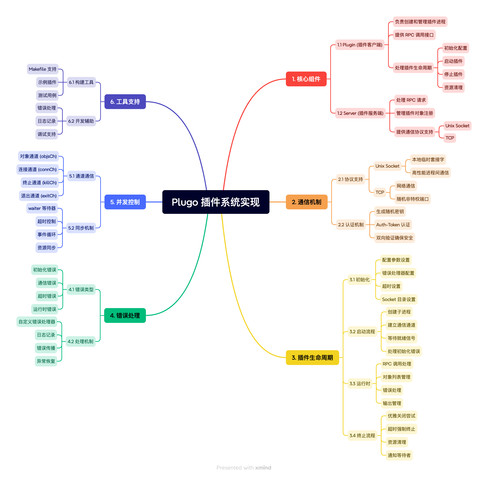

# Plugo: Go语言的插件系统

Plugo 是一个简单的独立库，用于为你的 Go 程序创建插件。由于 Go 是静态链接的，所有插件都以外部进程的形式运行。
该库旨在尽可能简单，并模仿标准 RPC 包，使大多数开发者能够立即熟悉使用。
Plugo 同时支持 TCP 和 Unix 作为通信协议。但是，目前不支持远程插件。如果有需求，可能会实现远程插件功能。



## 示例

创建一个新插件。创建一个以插件命名的目录（例如 `plugins/hello-world`），然后编写 `main.go` 如下：

```go
// 始终创建一个新的二进制文件
package main

import "github.com/BeCrafter/plugo"

// 创建一个要导出的对象
type MyPlugin struct{}

// 导出的方法，带有 RPC 签名
func (p *MyPlugin) SayHello(name string, msg *string) error {
    *msg = "Hello, " + name
    return nil
}

func main() {
    plugin := &MyPlugin{}

    // 注册要导出的对象
    plugo.Register(plugin)
    // 运行主事件处理器
    plugo.Run()
}
```

然后编译它：

```sh
cd plugins/hello-world
go build
```

你会得到一个名为 hello-world 的可执行文件。恭喜，这就是你的插件。
现在，是时候使用刚刚创建的插件了。
在你的主可执行文件中，调用你刚刚创建的插件：

```go
package main

import (
    "log"
    "github.com/BeCrafter/plugo"
)

func main() {
    // 从我们创建的可执行文件创建一个新插件。通过 TCP 连接
    p := plugo.NewPlugin("tcp", "plugins/hello-world/hello-world")
    // 实际启动插件
    p.Start()
    // 记得在使用完后停止插件
    defer p.Stop()

    var resp string

    // 调用我们之前创建的对象中的函数
    if err := p.Call("MyPlugin.SayHello", "Go developer", &resp); err != nil {
        log.Print(err)
    } else {
        log.Print(resp)
    }
}
```

现在，构建你的可执行文件，一切就绪！记住在创建 Plugin 对象时使用正确的插件路径。理想情况下，始终使用绝对路径。

## Unix 还是 TCP？
当分配新插件（通过 NewPlugin ）时，你需要选择使用 Unix 还是 TCP。
一般来说，建议使用 Unix：它的开销要小得多。但是，如果你选择 Unix，你应该提供一个可写的目录来放置临时套接字。在调用 Start 之前使用 SetSocketDirectory 来实现这一点。
如果你没有指定目录，将使用你的操作系统的默认临时目录。但是请注意，出于安全原因，可能无法在那里创建套接字。建议始终指定一个本地目录。
否则，在本地使用 TCP 的开销可以忽略不计。
即使通过 TCP，你的 Plugo 插件也不会接受非本地连接。

## Bugs
请在 Github 上报告 bug。欢迎提交 pull requests！

## TODO
- 自动重启崩溃的插件
- 如果其中一个设置失败，自动在 unix 和 TCP 之间切换

## 许可证
MIT

## 优化项

基于对 Plugo 项目的分析，我建议从以下几个方面进行优化：

1. 插件生命周期管理
- 添加插件健康检查机制
- 实现插件自动重启功能
- 引入插件状态监控和报告
- 支持插件热更新/热重载

2. 通信机制增强
- 支持双向通信，允许插件主动通知主程序
- 添加消息压缩机制，优化大数据传输
- 实现通信协议的版本管理
- 支持批量调用优化

3. 安全性提升
- 增加插件签名验证机制
- 实现细粒度的权限控制系统
- 添加通信加密选项
- 支持插件运行时资源限制

4. 性能优化
- 实现连接池机制
- 添加调用结果缓存
- 支持异步调用模式
- 优化序列化/反序列化性能

5. 可用性改进
- 提供插件依赖管理机制
- 实现插件配置热更新
- 添加插件运行时指标收集
- 支持插件调试模式

6. 容错性增强
- 实现优雅降级机制
- 添加熔断器模式
- 支持请求重试策略
- 完善错误恢复机制

7. 开发体验优化
- 提供插件开发脚手架
- 实现插件测试框架
- 添加开发时热重载支持
- 提供性能分析工具

8. 部署便利性
- 支持插件远程部署
- 实现插件版本管理
- 添加插件依赖自动解析
- 提供部署配置模板

9. 监控与运维
- 实现详细的监控指标
- 提供运行时诊断接口
- 支持日志集中管理
- 添加告警机制

10. 扩展性增强
- 支持多语言插件
- 实现插件间通信机制
- 提供插件发现服务
- 支持集群化部署

这些优化建议基于实际应用场景，可以根据具体需求选择性实施。建议按照优先级逐步实现，确保系统的稳定性和可维护性。